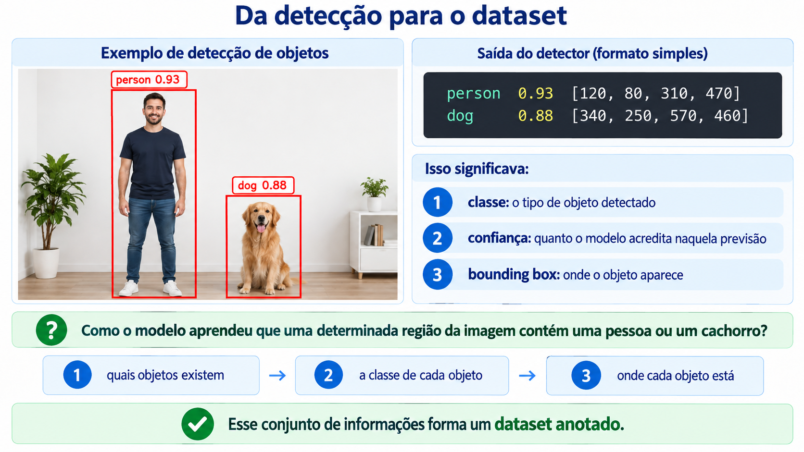
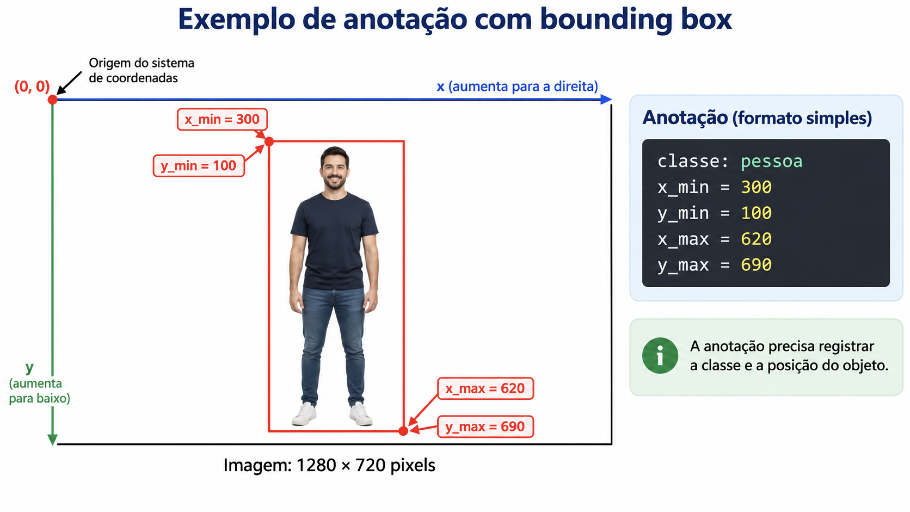
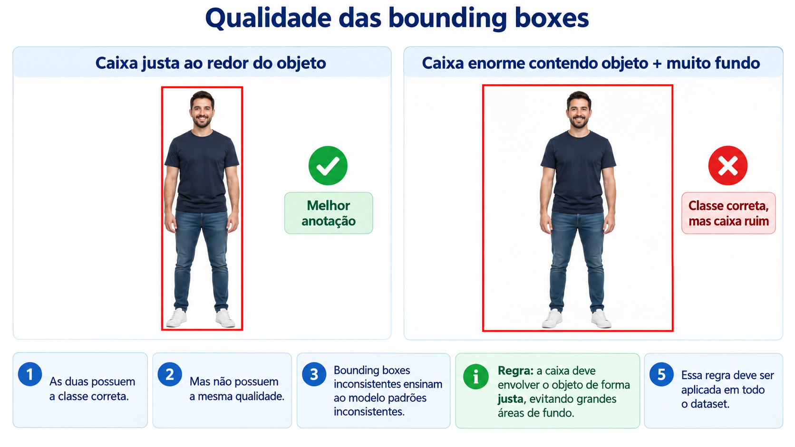

# Dataset para Detecção de Objetos

Usamos modelos já treinados para responder:

> **quais objetos aparecem na imagem e onde está cada um?**

Vamos olhar para o problema anterior ao treinamento:

> **como ensinar um modelo a reconhecer os objetos que queremos detectar?**

## 1. Da detecção para o dataset

Na aula anterior, um detector retornava algo parecido com:



---

## 2. O que existe em um dataset de detecção?

Em classificação, normalmente temos uma relação como:

```text
imagem → classe
```

Por exemplo:

```text
gato_01.jpg → gato
cachorro_01.jpg → cachorro
```

Em detecção, a situação é diferente.

Uma única imagem pode possuir vários objetos:

```text
imagem_01.jpg
    pessoa → bounding box
    pessoa → bounding box
    cachorro → bounding box
    bicicleta → bounding box
```

Portanto, o rótulo não pertence apenas à imagem inteira.

Ele pertence a **cada objeto anotado dentro da imagem**.

### Exemplo



Considere uma imagem de 1280 × 720 pixels.

Uma pessoa pode ocupar a região:

```text
x_min = 300
y_min = 100
x_max = 620
y_max = 690
```

A anotação precisa registrar a classe e a posição desse objeto.

---

## 3. Bounding boxes

Uma bounding box é normalmente representada por um retângulo.

Existem diferentes maneiras de armazenar esse retângulo.

### Formato pelos cantos

```text
[x_min, y_min, x_max, y_max]
```

### Formato pelo centro

```text
[x_centro, y_centro, largura, altura]
```

O formato utilizado depende da ferramenta e do framework.

O formato YOLO utiliza:

```text
classe x_centro y_centro largura altura
```

com as coordenadas normalizadas entre 0 e 1.

Por exemplo:

```text
0 0.512 0.483 0.221 0.607
```

significa:

| Valor | Significado |
|---|---|
| `0` | índice da classe |
| `0.512` | centro da caixa no eixo X |
| `0.483` | centro da caixa no eixo Y |
| `0.221` | largura da caixa |
| `0.607` | altura da caixa |

As coordenadas são normalizadas em relação ao tamanho da imagem.

---

## 4. Por que normalizar as coordenadas?

Imagine duas imagens:

```text
Imagem A → 640 × 480
Imagem B → 1920 × 1080
```

Uma caixa com largura de 200 pixels representa proporções muito diferentes nessas duas imagens.

Por isso, o formato YOLO divide as coordenadas pelo tamanho da imagem.

Se:

```text
x_centro = 320
largura_imagem = 640
```

O valor normalizado de X será:

```text
x_centro_normalizado = 320 / 640 = 0,5
```

O mesmo raciocínio é aplicado para `y`, largura e altura.

!!! question "Previsão"

    Uma caixa possui centro X igual a 200 pixels em uma imagem com largura de 800 pixels.

    Qual será o valor normalizado de X?

    **Resposta:** 0,25.

---

## 5. Organização de um dataset

Uma organização muito comum para datasets no formato YOLO é:

```text
dataset/
│
├── images/
│   ├── train/
│   └── val/
│
├── labels/
│   ├── train/
│   └── val/
│
└── data.yaml
```

Para uma imagem:

```text
images/train/foto_001.jpg
```

podemos ter:

```text
labels/train/foto_001.txt
```

O arquivo `.txt` contém uma linha para cada objeto anotado.

Exemplo:

```text
0 0.45 0.53 0.20 0.61
1 0.72 0.60 0.18 0.24
```

Isso representa **dois objetos diferentes na mesma imagem**.

---

## 6. O arquivo `data.yaml`

Além das imagens e anotações, precisamos dizer ao framework:

- onde estão os dados;
- quais são as divisões;
- quais são as classes.

Exemplo:

```yaml
path: dataset

train: images/train
val: images/val

names:
  0: pessoa
  1: bicicleta
  2: cachorro
```

Esse arquivo funciona como uma espécie de **mapa do dataset**.

---

## 7. Criando nossas próprias anotações

Para criar um dataset de detecção, normalmente usamos uma ferramenta gráfica.

Nesta aula, você pode utilizar **LabelImg** ou **CVAT**.

O processo é simples:

1. abrir a imagem;
2. desenhar uma bounding box;
3. escolher a classe;
4. repetir para os demais objetos;
5. exportar as anotações.

A ferramenta evita que seja necessário calcular manualmente cada coordenada.


## 8. Anotar não é apenas desenhar caixas

Um dataset pode estar tecnicamente correto e ainda assim produzir um modelo ruim.

Considere um detector de capacetes.

Se todas as imagens de treinamento forem:

- tiradas durante o dia;
- com fundo claro;
- com pessoas de frente;
- com o objeto totalmente visível;

o modelo pode ter dificuldade quando encontrar:

- iluminação diferente;
- pessoas de lado;
- capacetes parcialmente escondidos;
- objetos pequenos;
- fundos diferentes.

O dataset precisa representar a **variabilidade do problema real**.

---

## 9. Representatividade

Um bom dataset deve conter exemplos próximos das situações encontradas durante o uso do modelo.

Algumas variações importantes:

| Variação | Exemplos |
|---|---|
| iluminação | claro, escuro, sombra |
| escala | objeto perto e longe |
| posição | centro, bordas |
| orientação | frente, lado, inclinado |
| fundo | ambientes diferentes |
| oclusão | objeto parcialmente escondido |
| qualidade | diferentes câmeras e resoluções |

Um dataset com muitas imagens não é automaticamente um bom dataset.

A pergunta mais importante é:

> **essas imagens representam o problema que o modelo encontrará?**

---

## 10. Desbalanceamento de classes

Considere um dataset:

```text
pessoa      → 2.000 exemplos
bicicleta   →   800 exemplos
capacete    →    70 exemplos
```

Temos um conjunto **desbalanceado**.

O modelo encontra muito mais exemplos de pessoa do que de capacete.

Isso pode fazer com que algumas classes sejam aprendidas melhor do que outras.

!!! question "Previsão"

    Se nosso objetivo principal é detectar capacetes, seria suficiente adicionar milhares de imagens de pessoas sem aumentar a quantidade e a diversidade de capacetes?

    **Não.** Precisamos analisar a distribuição das classes e principalmente a diversidade dos exemplos relevantes.

---

## 11. Qualidade das caixas

Considere estas duas anotações:




Embora as duas possuem a classe correta. o resultado é diferente porque não possuem a mesma qualidade. Bounding boxes inconsistentes ensinam ao modelo padrões inconsistentes.

Durante a anotação, precisamos definir uma regra.

Por exemplo:

> A caixa deve envolver o objeto de forma justa, evitando grandes áreas de fundo.


## 12. Atividade prática

### Parte A — Criação

Seu objetivo é criar um pequeno dataset que poderá ser utilizado posteriormente para treinar um modelo customizado de detecção de objetos.

Escolha um problema simples com **2 ou 3 classes**.

Exemplos:

```text
garrafa / copo
caneta / lápis
celular / teclado
mochila / pessoa
```

Produza ou colete pelo menos **20 imagens** contendo os objetos escolhidos.

>> Tire as fotos com o celular, com diferentes posições, escalas, fundos e iluminações.

### Parte B — Anotação

Agora vamos criar o ground truth, ou seja, as anotações que representam a resposta correta esperada para cada imagem. 

utilize o Roboflow, CVAT, Label Studio ou outra ferramenta equivalente.

Para cada imagem:

- desenhe as bounding boxes;
- associe corretamente a classe;
- mantenha um padrão de anotação.

---

Na próxima aula, vamos usar o **dataset criado por nós** para treinar um detector para um problema específico.
