## Introdução às CNNs


Material da Aula 8 de Deep Learning + API de Visão Computacional.
Treinamento de uma CNN no PyTorch com CIFAR-10 e deploy do modelo via FastAPI, com interface web para upload de imagem.

Vamos manter o mesmo estilo de projeto que voce ja conhece no curso:

[Notebook-CNN + API FastAPI (download)](lab10/api/02_api_fastapi.zip){ .md-button .md-button-primary }


### o que são CNNs e para que servem?


As **Redes Neurais Convolucionais (CNNs)** são um tipo de rede neural artificial, projetada para processar dados que possuem uma **estrutura topológica similar a uma grade**, como:

Aplicações comuns:

- Classificação e segmentação de imagens
- Reconhecimento facial e detecção de objetos
- Análise de sinais e séries temporais
- Bioinformática (motivos em DNA/RNA)

### Vantagens sobre MLPs

| Aspecto | MLP | CNN |
|---------|-----|-----|
| Parâmetros | Crescem explosivamente | Muito menos (filtros reutilizados) |
| Estrutura espacial | Perdida | Preservada |
| Robustez a deslocamentos | Baixa | Maior (quase invariante a translação) |
| Compartilhamento de pesos | Não | Sim |
| Escalabilidade em visão | Limitada | Alta |

### Arquitetura Geral de uma CNN

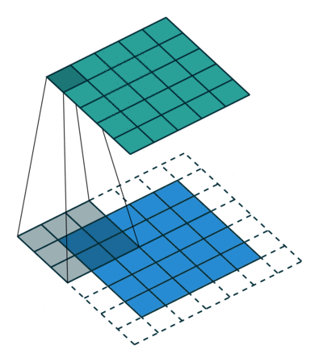


### Convolução (Intuição)

A convolução mede o alinhamento entre um pequeno padrão (kernel) e regiões da entrada. 

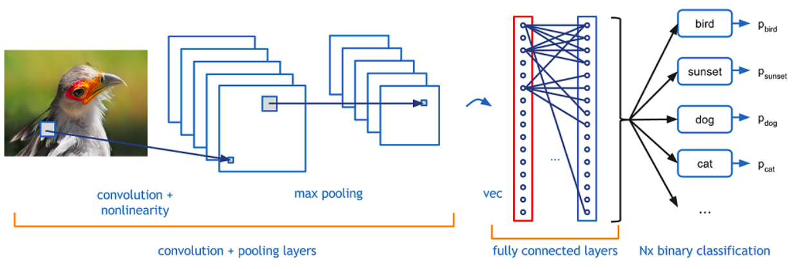


**Convolução Contínua:**

$$
(f * g)(t) = \int_{-\infty}^{\infty} f(\tau)g(t-\tau)\,d\tau
$$

**Convolução Discreta (usada em CNNs):**


$$
(f * g)[n] = \sum_{m=-\infty}^{\infty} f[m]g[n-m]
$$

### Convolução 2D para Imagens

Em visão usamos, tecnicamente, **correlação cruzada** (não invertendo o kernel), mas chamamos de convolução por convenção.

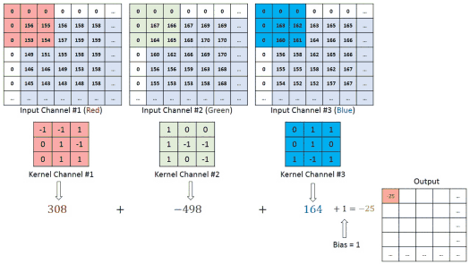

$$
S(i,j) = (I * K)(i,j) = \sum_{m}\sum_{n} I(i+m, j+n)\,K(m,n)
$$

Onde:

- `I`: Imagem de entrada
- `K`: Kernel (filtro)
- `S`: Feature map (mapa de características)

### Exemplo Prático de Convolução

**Imagem 5×5:**
$$
I = \begin{bmatrix}
1 & 2 & 3 & 0 & 1 \\
0 & 1 & 2 & 3 & 1 \\
1 & 0 & 1 & 2 & 0 \\
2 & 1 & 0 & 1 & 2 \\
1 & 0 & 2 & 1 & 0
\end{bmatrix}
$$

**Kernel 3×3 (Detector de Borda):**
$$
K = \begin{bmatrix}
-1 & -1 & -1 \\
-1 & 8 & -1 \\
-1 & -1 & -1
\end{bmatrix}
$$

**Resultado (Feature Map):**
$$
S(1,1) = (-1\cdot1) + (-1\cdot2) + (-1\cdot3) + (-1\cdot0) + (8\cdot1) + (-1\cdot2) + (-1\cdot1) + (-1\cdot0) + (-1\cdot1) = -5
$$

## Parametros da Camada Convolucional

### 1. Kernel/Filtro

- **Tamanho**: Normalmente 3×3, 5×5, 7×7
- **Profundidade do kernel**: Igual à profundidade da entrada
- **Nº de filtros**: Hyperparâmetro (32, 64, 128, 256...)
- **Pesos**: Aprendidos durante treinamento

### 2. Stride (Passo)

- **Definição**: Quantos pixels o kernel "pula" a cada operação
- **Stride = 1**: Sobreposição máxima
- **Stride = 2**: Reduz dimensão pela metade


### 3. Padding (Preenchimento)

- **Valid**: Sem padding (saída menor)
- **Same**: Padding para manter dimensão
- **Causal**: Para dados sequenciais

<quiz>
Efeito de padding='valid' com kernel 3×3 e stride=1 em H×W?
- [ ] Aumenta tamanho
- [x] Reduz 2 pixels (1 por borda)
- [ ] Não altera
- [ ] Dobra dimensões

Sem padding, a janela não cobre bordas externas totalmente, reduzindo largura e altura em 1 de cada lado.
</quiz>

<quiz>
Principal efeito de stride=2 em convolução?
- [ ] Aumentar resolução espacial
- [x] Diminuir resolução e custo computacional
- [ ] Substituir função de ativação
- [ ] Tornar o kernel maior

Stride>1 “pula” posições, gerando feature maps menores e operação mais barata.
</quiz>


## Tipos de Convoluções

### Convolução Standard


```python
nn.Conv2d(in_channels=3, out_channels=32, kernel_size=3, stride=1, padding=1)
```
onde:
- `in_channels`: número de canais da entrada (ex: 3 para RGB)
- `out_channels`: número de filtros (feature maps) gerados pela camada
- `kernel_size`: tamanho do filtro (ex: 3 para 3x3)
- `stride`: passo da convolução (ex: 1 para sem sobreposição)
- `padding`: tipo de preenchimento (ex: 1 para manter dimensão)

### Convolução Depthwise Separable


```python
# Depthwise
nn.Conv2d(in_channels=3, out_channels=3, kernel_size=3, stride=1, padding=1, groups=3)
# Pointwise
nn.Conv2d(in_channels=3, out_channels=32, kernel_size=1)
``` 

onde:
- `groups=3` indica que cada canal é convoluído separadamente (depthwise)
- A convolução pointwise (1x1) combina os canais resultantes para gerar os 32 filtros finais.

- **Vantagem**: Menos parâmetros (~9x redução)
- **Uso**: MobileNets, Xception


### Convolução Dilatada (Atrous)


```python
nn.Conv2d(in_channels=3, out_channels=32, kernel_size=3, stride=1, padding=2, dilation=2)
```   
onde:
- `dilation=2` indica que os elementos do kernel são espaçados, aumentando o campo receptivo sem aumentar o número de parâmetros.

- **Vantagem**: Campo receptivo maior sem perder resolução
- **Uso**: Segmentação semântica

### Convolução Transposta (Deconvolução)


```python
nn.ConvTranspose2d(in_channels=32, out_channels=3, kernel_size=3, stride=2)   
```
- **Uso**: Upsampling, GANs, Autoencoders

onde:
- `ConvTranspose2d` é usada para aumentar a dimensão espacial, funcionando como o inverso da convolução padrão.


### Visualização da Convolução

<div id="cnn-widget" style="max-width:1100px;margin:1rem 0;padding:1rem;border:1px solid #e5e7eb;border-radius:12px;background:var(--md-default-bg-color,#fff)">
  <h3 style="margin-top:0">CNN – Convolução, Ativação e Pooling (interativo)</h3>

  <div style="display:flex;gap:1rem;flex-wrap:wrap;align-items:flex-start">
    <!-- Coluna esquerda: entrada/desenho -->
    <div style="flex:1 1 260px">
      <div style="display:flex;gap:.5rem;align-items:center;margin-bottom:.5rem">
        <strong>Entrada (28×28)</strong>
        <button id="cnn_clear" class="md-button">Limpar</button>
        <button id="cnn_noise" class="md-button">Ruído</button>
        <button id="cnn_demo" class="md-button">Demo “7”</button>
      </div>
      <canvas id="cnn_input" width="196" height="196" style="image-rendering:pixelated;border:1px solid #ccc;border-radius:8px;background:#fff"></canvas>
      <div style="font-size:.85em;color:#666;margin-top:.25rem">Dica: desenhe com o mouse (clique e arraste). A imagem é 28×28, mostrada ampliada.</div>
    </div>

    <!-- Coluna centro: controles -->
    <div style="flex:1 1 280px">
      <div style="display:grid;grid-template-columns:1fr 1fr;gap:.75rem">
        <label style="grid-column:1/-1">
          <div><strong>Kernel</strong></div>
          <select id="cnn_kernel" style="width:100%">
            <option value="identity">Identity</option>
            <option value="blur">Blur (Box)</option>
            <option value="sharpen">Sharpen</option>
            <option value="edge_lap">Edge (Laplacian)</option>
            <option value="sobel_x">Sobel X</option>
            <option value="sobel_y">Sobel Y</option>
            <option value="emboss">Emboss</option>
            <option value="custom">Custom (3×3)</option>
          </select>
        </label>

        <div id="cnn_custom_wrap" style="grid-column:1/-1;display:none">
          <div style="margin:.25rem 0">Kernel 3×3 (Custom):</div>
          <div style="display:grid;grid-template-columns:repeat(3,1fr);gap:.25rem">
            <input class="cnn_k" type="number" step="0.1" value="0">
            <input class="cnn_k" type="number" step="0.1" value="0">
            <input class="cnn_k" type="number" step="0.1" value="0">
            <input class="cnn_k" type="number" step="0.1" value="0">
            <input class="cnn_k" type="number" step="0.1" value="1">
            <input class="cnn_k" type="number" step="0.1" value="0">
            <input class="cnn_k" type="number" step="0.1" value="0">
            <input class="cnn_k" type="number" step="0.1" value="0">
            <input class="cnn_k" type="number" step="0.1" value="0">
          </div>
        </div>

        <label>
          <div><strong>Padding</strong></div>
          <select id="cnn_padding" style="width:100%">
            <option value="same">same</option>
            <option value="valid">valid</option>
          </select>
        </label>

        <label>
          <div><strong>Stride</strong></div>
          <input id="cnn_stride" type="number" min="1" max="4" step="1" value="1" style="width:100%">
        </label>

        <label>
          <div><strong>Ativação</strong></div>
          <select id="cnn_act" style="width:100%">
            <option value="none">None</option>
            <option value="relu">ReLU</option>
          </select>
        </label>

        <label>
          <div><strong>Pooling</strong></div>
          <select id="cnn_pool" style="width:100%">
            <option value="none">None</option>
            <option value="max">Max 2×2 (s=2)</option>
            <option value="avg">Avg 2×2 (s=2)</option>
          </select>
        </label>

        <div style="grid-column:1/-1;display:flex;gap:.5rem;margin-top:.25rem">
          <button id="cnn_apply" class="md-button md-button--primary">Aplicar</button>
          <button id="cnn_reset" class="md-button">Reset kernel</button>
        </div>

        <div style="grid-column:1/-1;font-size:.9em;color:#444">
          <div><strong>Saídas:</strong></div>
          <div>Conv: <span id="cnn_shape_conv">—</span> • Pool: <span id="cnn_shape_pool">—</span></div>
          <div>Resumo: <span id="cnn_summary">—</span></div>
        </div>
      </div>
    </div>

    <!-- Coluna direita: saídas -->
    <div style="flex:1 1 260px">
      <div style="margin-bottom:.5rem"><strong>Feature map (após conv/ativação)</strong></div>
      <canvas id="cnn_feat" width="196" height="196" style="image-rendering:pixelated;border:1px solid #ccc;border-radius:8px;background:#fff"></canvas>

      <div style="margin:.75rem 0 .5rem"><strong>Pooling (veremos a seguir)</strong></div>
      <canvas id="cnn_pool_canvas" width="196" height="196" style="image-rendering:pixelated;border:1px solid #ccc;border-radius:8px;background:#fff"></canvas>
    </div>
  </div>
</div>


## Pooling e Subsampling

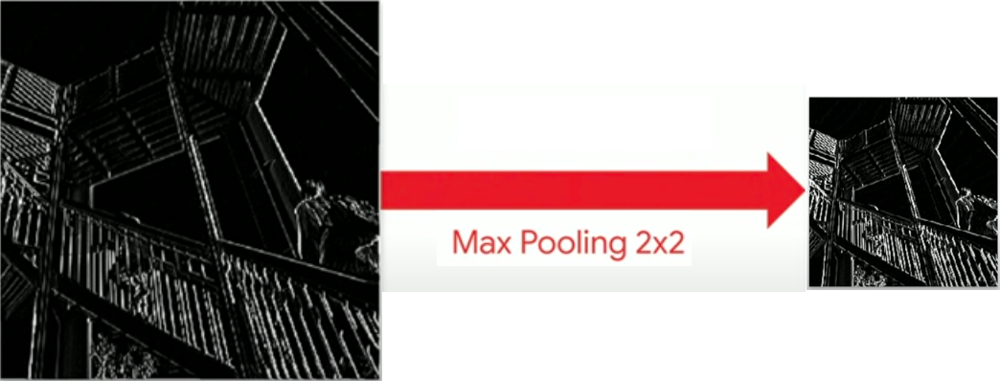

Diminui tamanho dos feature maps alem de permitir que pequenas translações não afetem resultado, ajuda na redução de overfitting e acelera o processamento.

### Max Pooling

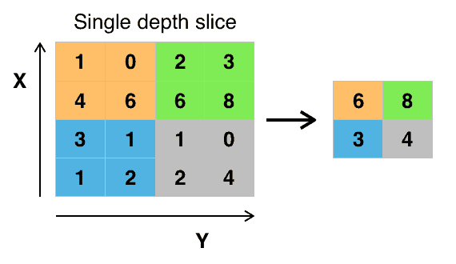


```python
nn.MaxPool2d(kernel_size=(2,2), stride=(2,2))
```
Mantém o valor mais forte (presença de padrão).

onde:
- `kernel_size=(2,2)`: janela de pooling 2x2
- `stride=(2,2)`: move a janela 2 pixels (sem sobreposição)

### Average Pooling

Suaviza (média local), diluindo picos.


```python
nn.AvgPool2d(kernel_size=(2,2), stride=(2,2))
```
onde:
- `kernel_size=(2,2)`: janela de pooling 2x2
- `stride=(2,2)`: move a janela 2 pixels (sem sobreposição)


### Adaptive Average Pooling

Resume cada feature map em um único número. Substitui densas finais, reduz parâmetros.


```python
nn.AdaptiveAvgPool2d((1,1))
```
onde:
- `AdaptiveAvgPool2d((1,1))` ajusta o kernel para reduzir cada feature map a 1x1, independentemente do tamanho de entrada.

---


<quiz>
Diferença essencial Max vs Average Pooling?
- [ ] Max reduz canais, Average aumenta canais
- [x] Max preserva picos; Average suaviza respostas
- [ ] Average não é diferenciável
- [ ] São iguais em prática

Max enfatiza presença; Average enfatiza contexto médio.
</quiz>


## Batch Normalization

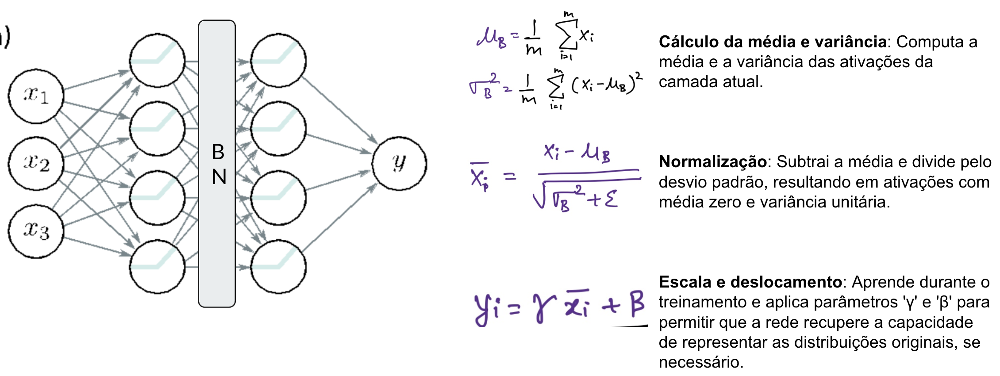

A **Batch Normalization** é uma técnica que normaliza as ativações de uma camada, mantendo a média próxima de 0 e o desvio padrão próximo de 1.

- Acelera o treinamento
- Reduz a sensibilidade à inicialização dos pesos
- Permite usar taxas de aprendizado maiores
- Atua como uma forma leve de regularização

> Saiba mais em: [https://machinelearningmastery.com/batch-normalization-for-training-of-deep-neural-networks/](https://machinelearningmastery.com/batch-normalization-for-training-of-deep-neural-networks/)


```python
nn.BatchNorm2d(num_features=32)  # normaliza os 32 canais de saída da camada convolucional
```
onde:
- `num_features=32` indica o número de canais a serem normalizados, geralmente igual ao número de filtros da camada anterior.

## Dropout

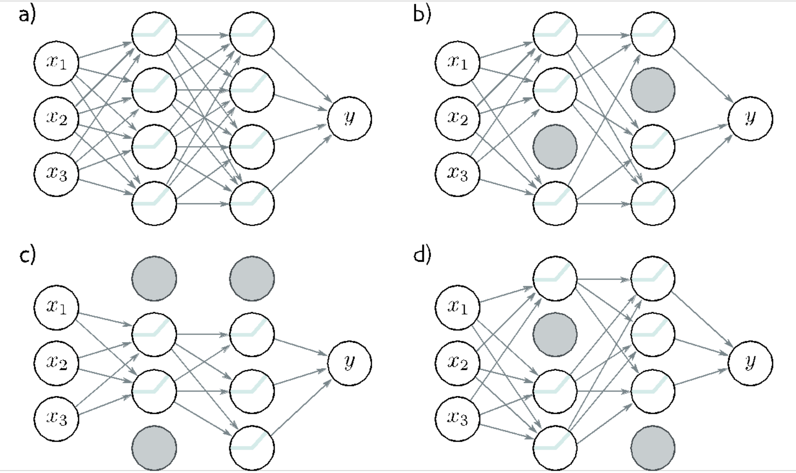

O **Dropout** é uma técnica de regularização que desativa aleatoriamente uma fração dos neurônios durante o treinamento. Isso força a rede a não depender de neurônios específicos, promovendo robustez e generalização. Utilize dropout principalmente em redes densas (fully connected).

- Reduz o overfitting
- Simples de implementar
- Funciona bem em redes densas e convolucionais

```python
nn.Dropout(p=0.5)  # desativa 50% dos neurônios durante o treinamento
```
onde:
- `p=0.5` indica a probabilidade de desativar cada neurônio durante o treinamento. Durante a inferência, o dropout é desativado e os pesos são escalados para compensar a ausência de dropout.


> Saiba mais em: [https://www.deeplearningbook.com.br/capitulo-23-como-funciona-o-dropout/](https://www.deeplearningbook.com.br/capitulo-23-como-funciona-o-dropout/)


---


## Arquiteturas Clássicas de CNN

### LeNet-5 (1998) - Yann LeCun

[](https://www.youtube.com/watch?v=FwFduRA_L6Q)


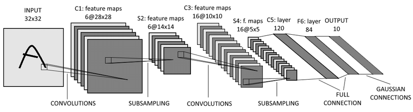


```python
import torch.nn as nn 
class LeNet5(nn.Module):
    def __init__(self):
        super().__init__()
        self.conv1 = nn.Conv2d(1, 6, kernel_size=5)
        self.pool1 = nn.AvgPool2d(kernel_size=2, stride=2)
        self.conv2 = nn.Conv2d(6, 16, kernel_size=5)
        self.pool2 = nn.AvgPool2d(kernel_size=2, stride=2)
        self.fc1 = nn.Linear(16*5*5, 120)
        self.fc2 = nn.Linear(120, 84)
        self.fc3 = nn.Linear(84, 10)

    def forward(self, x):
        x = torch.tanh(self.conv1(x))
        x = self.pool1(x)
        x = torch.tanh(self.conv2(x))
        x = self.pool2(x)
        x = x.view(-1, 16*5*5)  # flatten
        x = torch.tanh(self.fc1(x))
        x = torch.tanh(self.fc2(x))
        x = torch.softmax(self.fc3(x), dim=1)
        return x
```

onde:
- `Conv2d(1, 6, kernel_size=5)`: 1 canal de entrada (grayscale), 6 filtros, kernel 5x5
- `AvgPool2d(kernel_size=2, stride=2)`: pooling 2x2 com stride 2
- `Linear(16*5*5, 120)`: camada densa com 120 neurônios, recebendo a saída achatada da última camada convolucional.
- a função de ativação usada é `tanh`, e a saída final é uma distribuição de probabilidade sobre as 10 classes usando `softmax`, o `dim=1` indica que a softmax é aplicada ao longo do último eixo (as classes).


### AlexNet (2012) - Alex Krizhevsky

Primeira grande vitória em ImageNet: ReLU em larga escala, Dropout, Data Augmentation pesado, uso de múltiplas GPUs.

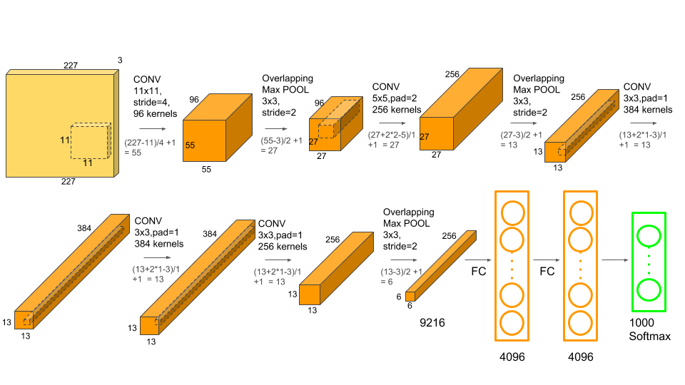


!!! note
    A AlexNet foi um marco pois provou que CNNs profundas funcionavam em datasets massivos e impulsionou a revolução do Deep Learning.


```python
import torch.nn as nn
class AlexNet(nn.Module):
    def __init__(self, num_classes=1000):
        super().__init__()
        self.features = nn.Sequential(
            nn.Conv2d(3, 96, kernel_size=11, stride=4, padding=2),
            nn.ReLU(inplace=True),
            nn.MaxPool2d(kernel_size=3, stride=2),
            nn.Conv2d(96, 256, kernel_size=5, padding=2),
            nn.ReLU(inplace=True),
            nn.MaxPool2d(kernel_size=3, stride=2),
            nn.Conv2d(256, 384, kernel_size=3, padding=1),
            nn.ReLU(inplace=True),
            nn.Conv2d(384, 384, kernel_size=3, padding=1),
            nn.ReLU(inplace=True),
            nn.Conv2d(384, 256, kernel_size=3, padding=1),
            nn.ReLU(inplace=True),
            nn.MaxPool2d(kernel_size=3, stride=2),
        )
        self.classifier = nn.Sequential(
            nn.Dropout(),
            nn.Linear(256 * 6 * 6, 4096),
            nn.ReLU(inplace=True),
            nn.Dropout(),
            nn.Linear(4096, 4096),
            nn.ReLU(inplace=True),
            nn.Linear(4096, num_classes),
        ) 
    def forward(self, x):
        x = self.features(x)
        x = x.view(x.size(0), 256 * 6 * 6)
        x = self.classifier(x)
        return x
``` 


### VGGNet (2014) - Oxford

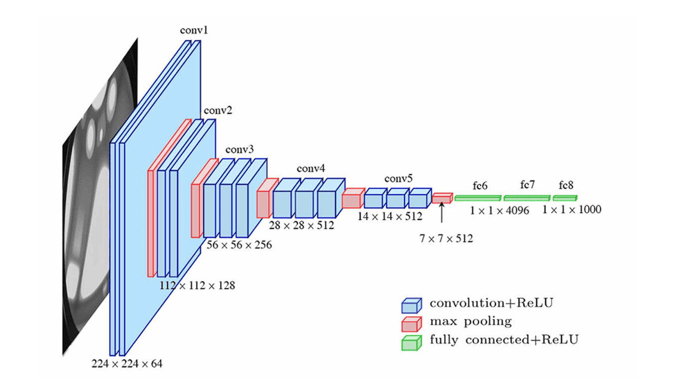

Convoluções pequenas (blocos de conv 3×3 + pooling) e profundas (16/19 camdas). 


```python
import torch.nn as nn
class VGG16(nn.Module):
    def __init__(self, num_classes=1000):
        super().__init__()
        self.features = nn.Sequential(
            # Bloco 1
            nn.Conv2d(3, 64, kernel_size=3, padding=1),
            nn.ReLU(inplace=True),
            nn.Conv2d(64, 64, kernel_size=3, padding=1),
            nn.ReLU(inplace=True),
            nn.MaxPool2d(kernel_size=2, stride=2),
            # Bloco 2
            nn.Conv2d(64, 128, kernel_size=3, padding=1),
            nn.ReLU(inplace=True),
            nn.Conv2d(128, 128, kernel_size=3, padding=1),
            nn.ReLU(inplace=True),
            nn.MaxPool2d(kernel_size=2, stride=2),
            # Bloco 3
            nn.Conv2d(128, 256, kernel_size=3, padding=1),
            nn.ReLU(inplace=True),
            nn.Conv2d(256, 256, kernel_size=3, padding=1),
            nn.ReLU(inplace=True),
            nn.Conv2d(256, 256, kernel_size=3, padding=1),
            nn.ReLU(inplace=True),
            nn.MaxPool2d(kernel_size=2, stride=2),
            # Bloco 4
            nn.Conv2d(256, 512, kernel_size=3, padding=1),
            nn.ReLU(inplace=True),
            nn.Conv2d(512, 512, kernel_size=3, padding=1),
            nn.ReLU(inplace=True),
            nn.Conv2d(512, 512, kernel_size=3, padding=1),
            nn.ReLU(inplace=True),
            nn.MaxPool2d(kernel_size=2, stride=2),
            # Bloco 5
            nn.Conv2d(512, 512, kernel_size=3, padding=1),
            nn.ReLU(inplace=True),
            nn.Conv2d(512, 512, kernel_size=3, padding=1),
            nn.ReLU(inplace=True),
            nn.Conv2d(512, 512, kernel_size=3, padding=1),
            nn.ReLU(inplace=True),
            nn.MaxPool2d(kernel_size=2, stride=2),
        )
        self.classifier = nn.Sequential(
            nn.Linear(512 * 7 * 7, 4096),
            nn.ReLU(inplace=True),
            nn.Dropout(),
            nn.Linear(4096, 4096),
            nn.ReLU(inplace=True),
            nn.Dropout(),
            nn.Linear(4096, num_classes),
        )
    def forward(self, x):
        x = self.features(x)
        x = x.view(x.size(0), 512 * 7 * 7) # flatten
        x = self.classifier(x)
        return x
```

onde:
- A arquitetura é composta por 5 blocos de convolução, cada um seguido por uma camada de pooling. O número de filtros dobra a cada bloco, começando em 64 e chegando a 512. Após as camadas convolucionais, há uma parte densa (classificador) com 3 camadas, onde as duas primeiras têm 4096 neurônios e a última camada tem `num_classes` neurônios, correspondendo ao número de classes de saída.
- A função de ativação usada é `ReLU`, e o dropout é aplicado entre as camadas densas para reduzir o overfitting. 
- O método `forward` define o fluxo de dados pela rede, primeiro passando pelas camadas convolucionais e depois pelas camadas densas após achatar a saída da última camada convolucional.


### ResNet (2015) - Microsoft Research

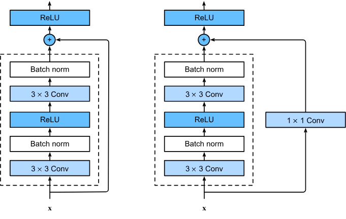

Resolveu o problema da degradação em redes muito profundas com Conexões Residuais (Skip Connections).


```python
import torch
import torch.nn as nn


class BasicBlock(nn.Module):
    def __init__(self, in_channels, out_channels, stride=1):
        super().__init__()

        self.conv1 = nn.Conv2d(
            in_channels,
            out_channels,
            kernel_size=3,
            stride=stride,
            padding=1,
            bias=False
        )
        self.bn1 = nn.BatchNorm2d(out_channels)
        self.relu = nn.ReLU(inplace=True)

        self.conv2 = nn.Conv2d(
            out_channels,
            out_channels,
            kernel_size=3,
            stride=1,
            padding=1,
            bias=False
        )
        self.bn2 = nn.BatchNorm2d(out_channels)

        self.downsample = None

        if stride != 1 or in_channels != out_channels:
            self.downsample = nn.Sequential(
                nn.Conv2d(
                    in_channels,
                    out_channels,
                    kernel_size=1,
                    stride=stride,
                    bias=False
                ),
                nn.BatchNorm2d(out_channels)
            )

    def forward(self, x):
        identity = x

        out = self.conv1(x)
        out = self.bn1(out)
        out = self.relu(out)

        out = self.conv2(out)
        out = self.bn2(out)

        if self.downsample is not None:
            identity = self.downsample(x)

        out = out + identity
        out = self.relu(out)

        return out


class ResNet18(nn.Module):
    def __init__(self, num_classes=1000):
        super().__init__()

        self.in_channels = 64

        self.conv1 = nn.Conv2d(
            3,
            64,
            kernel_size=7,
            stride=2,
            padding=3,
            bias=False
        )
        self.bn1 = nn.BatchNorm2d(64)
        self.relu = nn.ReLU(inplace=True)
        self.maxpool = nn.MaxPool2d(
            kernel_size=3,
            stride=2,
            padding=1
        )

        self.layer1 = self._make_layer(64,  blocks=2, stride=1)
        self.layer2 = self._make_layer(128, blocks=2, stride=2)
        self.layer3 = self._make_layer(256, blocks=2, stride=2)
        self.layer4 = self._make_layer(512, blocks=2, stride=2)

        self.avgpool = nn.AdaptiveAvgPool2d((1, 1))
        self.fc = nn.Linear(512, num_classes)

    def _make_layer(self, out_channels, blocks, stride):
        layers = []

        layers.append(
            BasicBlock(
                in_channels=self.in_channels,
                out_channels=out_channels,
                stride=stride
            )
        )

        self.in_channels = out_channels

        for _ in range(1, blocks):
            layers.append(
                BasicBlock(
                    in_channels=self.in_channels,
                    out_channels=out_channels,
                    stride=1
                )
            )

        return nn.Sequential(*layers)

    def forward(self, x):
        x = self.conv1(x)
        x = self.bn1(x)
        x = self.relu(x)
        x = self.maxpool(x)

        x = self.layer1(x)
        x = self.layer2(x)
        x = self.layer3(x)
        x = self.layer4(x)

        x = self.avgpool(x)
        x = torch.flatten(x, 1)
        x = self.fc(x)

        return x
```


<quiz>
Conexões residuais ajudam principalmente a:
- [ ] Diminuir o uso de GPU
- [x] Facilitar fluxo de gradiente em redes profundas
- [ ] Remover necessidade de normalização
- [ ] Eliminar funções de ativação

O atalho preserva sinais e gradientes, mitigando o problema de degradação.
</quiz>